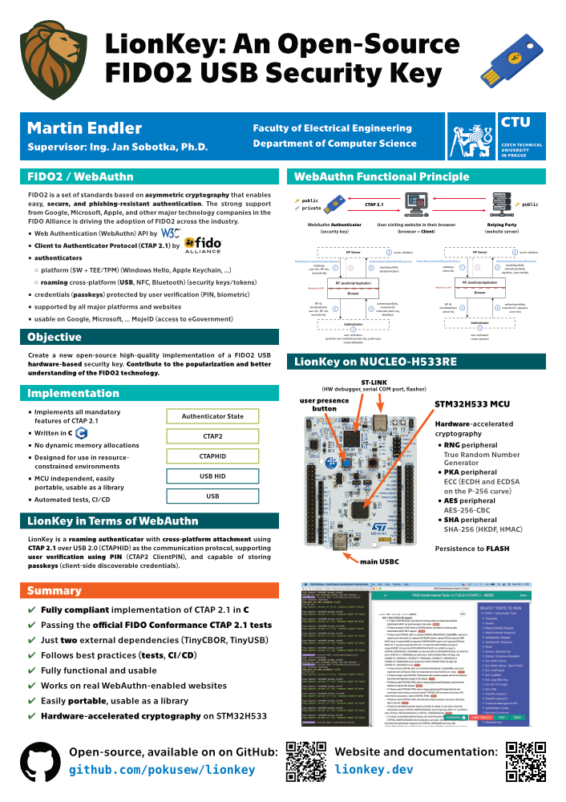

# FIDO2 USB Security Key

My Master's Thesis at [CTU FEE] ([ČVUT FEL]),
successfully defended (grade A, i.e., the best possible grade) on June 24, 2025.

📝 **Latest PDF export: 👉 [FIDO2_USB_Security_Key.pdf]**

📦 The source code of the implementation: 👉 **[pokusew/lionkey]**

🖼️ [Thesis Defense Presentation]

The TeX source of the thesis, including build script
can be found in the [text](./text) directory.  
The official assignment of the thesis and other formalities
can be found in the [formalities](./formalities) directory.

## Poster from PESW 2025

I presented my work as a student poster titled “LionKey: An Open-Source FIDO2 USB Security Key”
at the [13th Prague Embedded Systems Workshop (PESW)][PESW 2025 website] on June 27, 2025.

**I won first place 🥇 in the student poster competition**,
which featured a total of 11 high-quality student works.

See:
* 👉 **[Poster (print-quality PDF)](https://drive.google.com/file/d/1cVIc6w-SD0R4DIB0BwfQa_h6cJjnjyx2/view?usp=sharing)**
* [PESW 2025 website] (see the _Poster awards_ section)
* [Award Certificate Photo](https://drive.google.com/file/d/1Mo61wXNd-ykDdnlCTX8Oju6hMtyaOURZ/view?usp=sharing)
* [Poster Photo](https://drive.google.com/file/d/1t9jVEAxRhKxcXXp8y6smqQ82OvgA3taZ/view?usp=sharing)

<!-- links references -->

[pokusew/lionkey]: https://github.com/pokusew/lionkey

[FIDO2_USB_Security_Key.pdf]: https://github.com/pokusew/fel-masters-thesis/raw/main/text/FIDO2_USB_Security_Key.pdf

[Thesis Defense Presentation]: https://docs.google.com/presentation/d/12pIpleXDWQAHsmKjXbUiqhyiZhqAIqI8Lhsf10e0ypE/edit?usp=sharing

[CTU FEE]: https://fel.cvut.cz/en/

[ČVUT FEL]: https://fel.cvut.cz/cz/

[PESW 2025 website]: https://pesw.fit.cvut.cz/2025/
